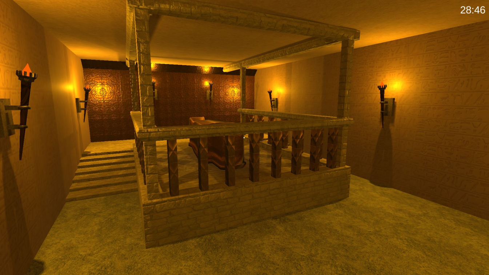

# Escape The Pyramid
Hochschule RheinMain - Medieninformatik - 3D-Animation - Wintersemester 2020/2021  
Projektarbeit von **Sandra Kiefer**

## Startanweisungen
Das exportierte Spiel wurde als WebGL exportiert und auf einem öffentlichen Server für den leichteren Zugang hochgeladen. Unter folgenden [Link](https://sandrakiefer.itch.io/escape-the-pyramid) und dem Password "HSRM_3D_skief" kann das Escape Game gespielt und gelöst werden. Damit das Spiel flüssig läuft sollte man eine gute und stabile Internetverbindung verwenden.

## Projektbeschreibung
*Escape The Pyramid* ist ein **First-Person-Exit-Game**, bei dem der Spieler versuchen  
muss, rechtzeitig aus einer Pyramide zu entkommen, bevor diese einstürzt.  
Auf dem Weg in die Freiheit muss der Spieler **verschiedene Schlüssel zum Öffnen der  
Türen** finde, einen Ausweg aus einem Labyrinth finden und **Rätsel lösen**. Verschiedene  
**verstecke Hinweise** können dem Spieler bei der Flucht aus der Pyramide helfen

## Dokumentation
Das Game Design Document befindet sich im Ordner `/Konzept` als `GameDesignDocument_EscapeThePyramid.pdf` und beinhaltet folgende Punkte:
 - **Game Design Übersicht** (Prägnante Beschreibung der Spielidee)
 - **Spiel-Konzept** (Beschreibung der Umgebung, der Bewegung und die Interaktionsmöglichkeiten)
 - **Game Design Schema** (Skizzierung des Aufbaus des Spieles)
 - **Technische Dokumentation** (Technische Übersicht, Systemeinschränkungen)
 - **Artwork** (Themen-Recherche, Art-Bible, Konzepte für Modelle und Animationen)
